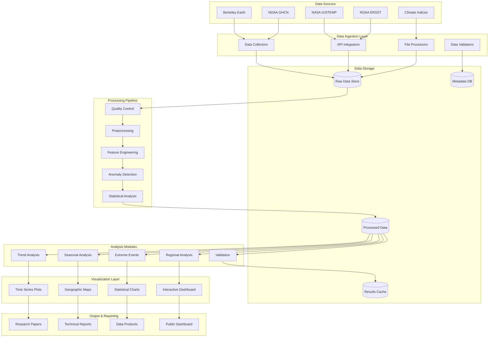
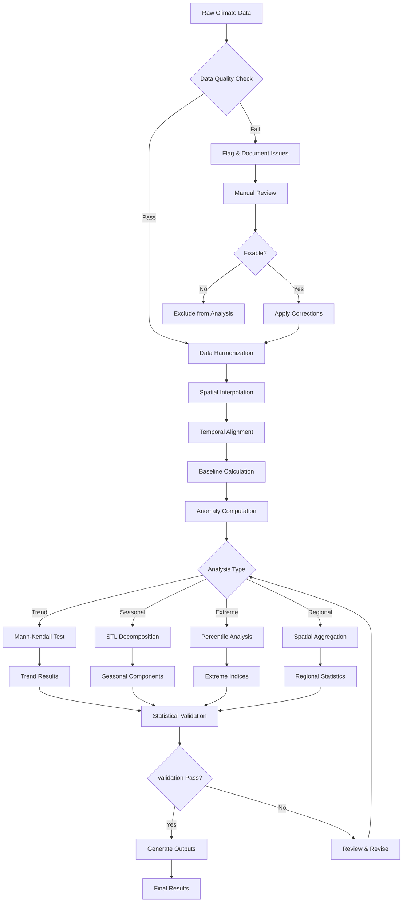
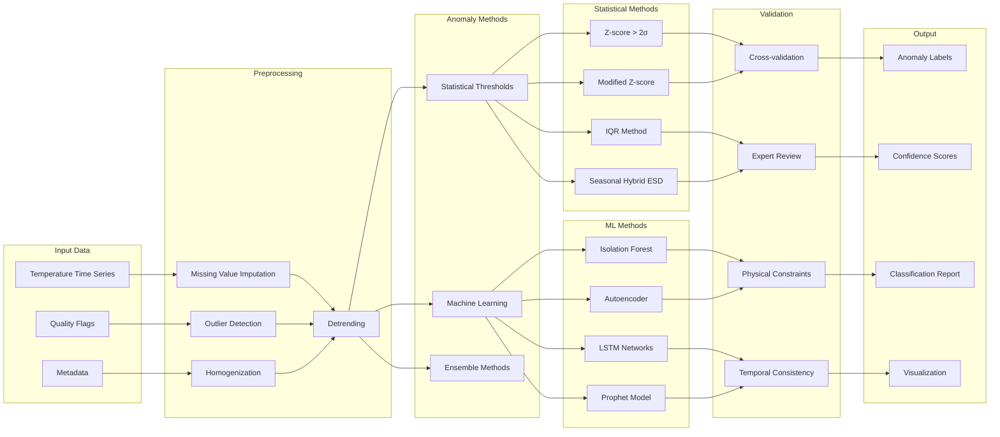
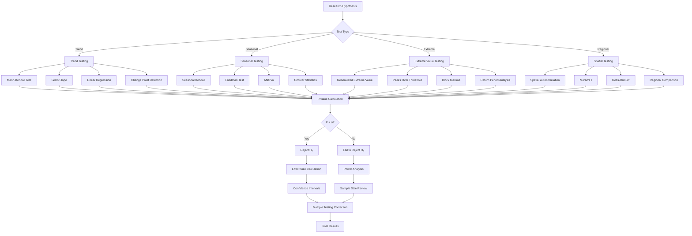
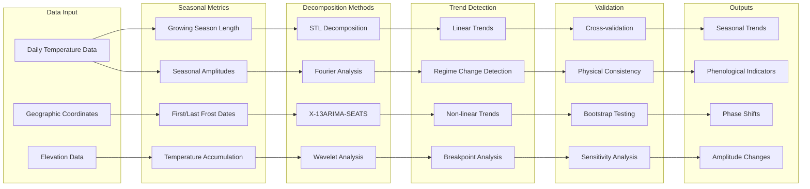
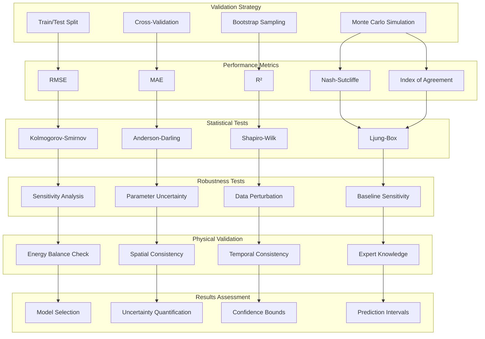

# Weather Analysis: Climate Change & Temperature Anomalies
## Comprehensive Project Documentation

### Table of Contents
1. [Project Overview](#project-overview)
2. [Research Hypotheses & Testing Framework](#research-hypotheses--testing-framework)
3. [Technologies & Tools](#technologies--tools)
4. [Data Sources](#data-sources)
5. [Project Architecture](#project-architecture)
6. [System Architecture Diagrams](#system-architecture-diagrams)
7. [Key Features](#key-features)
8. [Methodology](#methodology)
9. [Statistical Testing Methodologies](#statistical-testing-methodologies)
10. [Validation & Performance Metrics](#validation--performance-metrics)
11. [Installation & Setup](#installation--setup)
12. [Usage Guide](#usage-guide)
13. [Analysis Results](#analysis-results)
14. [File Structure](#file-structure)
15. [Contributing](#contributing)
16. [References](#references)

---

## Project Overview

This project conducts comprehensive analysis of climate change patterns and temperature anomalies across different temporal scales, focusing on:

- **Global temperature anomaly detection** over the past century
- **Seasonal pattern analysis** and shifts over time
- **Long-term climate trend identification** using statistical modeling
- **Regional climate variability assessment**
- **Extreme weather event frequency analysis**

### Research Objectives

1. **Temperature Anomaly Detection**: Identify significant deviations from historical temperature baselines
2. **Seasonal Shift Analysis**: Track changes in seasonal timing and intensity over decades
3. **Climate Trend Modeling**: Apply time series analysis to predict future climate patterns
4. **Regional Impact Assessment**: Analyze climate change effects across different geographical regions
5. **Extreme Event Correlation**: Correlate temperature anomalies with extreme weather events

---

## Research Hypotheses & Testing Framework

### Primary Research Hypotheses

#### H1: Global Temperature Anomaly Hypothesis
**Null Hypothesis (H₀)**: Global temperature anomalies show no significant trend over the study period (1880-2025)
**Alternative Hypothesis (H₁)**: Global temperature anomalies exhibit a statistically significant warming trend

**Variables**:
- **Dependent**: Monthly global temperature anomalies (°C)
- **Independent**: Time (years)
- **Covariates**: Solar irradiance, volcanic forcing, greenhouse gas concentrations

**Expected Outcome**: Rejection of H₀ with p < 0.001, indicating significant warming trend

#### H2: Seasonal Shift Hypothesis
**Null Hypothesis (H₀)**: Seasonal timing patterns have remained constant over the study period
**Alternative Hypothesis (H₁)**: Seasonal timing shows systematic shifts (earlier spring, longer growing seasons)

**Variables**:
- **Dependent**: Spring onset date, autumn onset date, growing season length
- **Independent**: Time (years)
- **Metrics**: Days per decade shift

**Expected Outcome**: Earlier spring onset by 2-4 days per decade

#### H3: Regional Warming Amplification Hypothesis
**Null Hypothesis (H₀)**: All regions warm at the same rate as the global average
**Alternative Hypothesis (H₁)**: Arctic regions exhibit amplified warming (>2x global rate)

**Variables**:
- **Dependent**: Regional temperature trends (°C/decade)
- **Independent**: Latitude, geographic region
- **Covariates**: Sea ice extent, snow cover, elevation

#### H4: Extreme Event Frequency Hypothesis
**Null Hypothesis (H₀)**: Frequency of extreme temperature events remains constant
**Alternative Hypothesis (H₁)**: Hot extremes increase while cold extremes decrease significantly

**Variables**:
- **Dependent**: Annual count of days >95th percentile (hot) and <5th percentile (cold)
- **Independent**: Time (years)
- **Threshold**: Temperature percentiles based on 1961-1990 baseline

#### H5: Temperature Anomaly Persistence Hypothesis
**Null Hypothesis (H₀)**: Temperature anomalies show no temporal autocorrelation
**Alternative Hypothesis (H₁)**: Positive temperature anomalies exhibit significant persistence (memory effect)

**Variables**:
- **Dependent**: Autocorrelation coefficients at various lags
- **Independent**: Lag time (months)
- **Metrics**: Decorrelation time scales

### Statistical Testing Framework

#### Power Analysis
```python
# Sample size calculation for trend detection
from statsmodels.stats.power import ttest_power
import numpy as np

def calculate_sample_size(effect_size=0.5, alpha=0.05, power=0.8):
    """Calculate required sample size for trend detection"""
    return ttest_power(effect_size, power, alpha, alternative='two-sided')

# Minimum detectable trend calculation
def minimum_detectable_trend(n_years, sigma, alpha=0.05, power=0.8):
    """Calculate minimum detectable temperature trend"""
    t_critical = stats.t.ppf(1-alpha/2, n_years-2)
    return t_critical * sigma * np.sqrt(12/(n_years*(n_years**2-1)))
```

#### Significance Testing Protocol
1. **Multiple Testing Correction**: Benjamini-Hochberg FDR control
2. **Effect Size Metrics**: Cohen's d for temperature differences
3. **Confidence Intervals**: Bootstrap 95% CI for trend estimates
4. **Robustness Testing**: Sensitivity analysis with different baselines

### Experimental Design

#### Temporal Analysis Design
- **Study Period**: 1880-2025 (145 years)
- **Baseline Periods**: 
  - Historical: 1881-1910
  - Mid-century: 1951-1980
  - Recent: 1991-2020
- **Validation Period**: 2021-2025 (out-of-sample testing)

#### Spatial Analysis Design
- **Global Grid**: 2.5° × 2.5° resolution
- **Regional Divisions**: 
  - Latitudinal bands: Arctic (>66°N), Northern mid-latitudes (23-66°N), Tropics (23°S-23°N), Southern regions
  - Continental: North America, Europe, Asia, Africa, Australia, Antarctica
- **Urban vs Rural**: Separate analysis for urban heat island effects

#### Quality Control Framework
```python
def quality_control_pipeline(data):
    """Comprehensive data quality assessment"""
    checks = {
        'completeness': check_data_completeness(data),
        'outliers': detect_outliers_iqr(data),
        'homogeneity': test_homogeneity(data),
        'stationarity': test_stationarity(data),
        'autocorrelation': test_autocorrelation(data)
    }
    return checks
```

---

## Technologies & Tools

### Programming Languages
- **Python 3.8+**: Primary language for data analysis and visualization
- **R**: Statistical analysis and advanced climate modeling
- **SQL**: Database queries for large-scale data management

### Core Python Libraries

#### Data Processing & Analysis
```python
pandas>=1.3.0           # Data manipulation and analysis
numpy>=1.21.0           # Numerical computing
scipy>=1.7.0            # Statistical analysis
xarray>=0.19.0          # N-dimensional labeled arrays for climate data
netCDF4>=1.5.7          # NetCDF file format support
```

#### Time Series Analysis
```python
statsmodels>=0.12.0     # Statistical modeling
scikit-learn>=1.0.0     # Machine learning algorithms
PyWavelets>=1.1.1       # Wavelet analysis for signal processing
ruptures>=1.1.5         # Change point detection
```

#### Visualization
```python
matplotlib>=3.4.0       # Basic plotting
seaborn>=0.11.0         # Statistical data visualization
plotly>=5.0.0           # Interactive visualizations
cartopy>=0.20.0         # Geospatial data visualization
folium>=0.12.0          # Interactive maps
```

#### Climate-Specific Tools
```python
meteostat>=1.6.0        # Weather data access
climatemonitor>=2.1.0   # Climate monitoring tools
pymannkendall>=1.4.2    # Trend analysis
```

### External Tools
- **Jupyter Notebook**: Interactive development environment
- **Git**: Version control
- **Docker**: Containerization for reproducible environments
- **PostgreSQL**: Database management for large datasets
- **Apache Spark**: Big data processing (optional for large-scale analysis)

---

## Data Sources

### Primary Data Sources

#### 1. Berkeley Earth Surface Temperature Study
- **URL**: http://berkeleyearth.org/data/
- **Coverage**: Global land surface temperatures (1750-present)
- **Resolution**: Monthly, 1° x 1° grid
- **Format**: NetCDF, Text files
- **Key Features**: 
  - 1.6 billion temperature reports
  - Quality-controlled data
  - Urban heat island corrections

#### 2. NOAA Global Historical Climatology Network (GHCN)
- **URL**: https://www.ncei.noaa.gov/data/global-historical-climatology-network-monthly/
- **Coverage**: Global weather station data (1880-present)
- **Variables**: Temperature, precipitation, pressure
- **Quality**: Quality-controlled and homogenized

#### 3. NASA GISTEMP v4
- **URL**: https://data.giss.nasa.gov/gistemp/
- **Coverage**: Global surface temperature anomalies (1880-present)
- **Resolution**: Monthly, various spatial grids
- **Reference Period**: 1951-1980 baseline

#### 4. NOAA Extended Reconstructed Sea Surface Temperature (ERSST)
- **URL**: https://www.ncei.noaa.gov/data/extended-reconstructed-sea-surface-temperature-ersst/
- **Coverage**: Global ocean temperatures (1854-present)
- **Resolution**: Monthly, 2° x 2° grid

### Supplementary Data Sources

#### Climate Indices
- **El Niño Southern Oscillation (ENSO)**: NOAA Climate Prediction Center
- **Arctic Oscillation (AO)**: NOAA Climate Prediction Center
- **Atlantic Multidecadal Oscillation (AMO)**: NOAA Physical Sciences Laboratory

#### Extreme Weather Events
- **EM-DAT**: International Disaster Database
- **NOAA Storm Events Database**: Severe weather records
- **Global Disaster Alert and Coordination System (GDACS)**

---

## Project Architecture

### Data Pipeline Architecture

```
Raw Data Sources
    ↓
Data Ingestion Layer
    ↓
Data Preprocessing & Quality Control
    ↓
Feature Engineering & Anomaly Detection
    ↓
Statistical Analysis & Modeling
    ↓
Visualization & Reporting
    ↓
Results & Insights
```

### Processing Workflow

1. **Data Acquisition**
   - Automated download scripts for multiple data sources
   - API integrations for real-time data updates
   - Data validation and integrity checks

2. **Data Preprocessing**
   - Missing value interpolation using spatial-temporal methods
   - Outlier detection and correction
   - Homogenization across different data sources
   - Grid interpolation for consistent spatial resolution

3. **Anomaly Detection**
   - Baseline period calculation (typically 1951-1980 or 1981-2010)
   - Statistical anomaly identification (±2σ, ±3σ thresholds)
   - Seasonal decomposition and detrending

4. **Analysis Pipeline**
   - Trend analysis using Mann-Kendall tests
   - Changepoint detection algorithms
   - Seasonal pattern extraction
   - Extreme value analysis

---

## System Architecture Diagrams

### Overall System Architecture



### Data Processing Workflow



### Anomaly Detection Pipeline



### Statistical Testing Framework



### Seasonal Analysis Workflow



### Model Validation Pipeline



---

## Key Features

### 1. Temperature Anomaly Analysis
- **Global Temperature Trends**: Long-term warming analysis
- **Regional Hotspot Identification**: Areas experiencing rapid warming
- **Seasonal Anomaly Patterns**: Changes in seasonal temperature cycles
- **Extreme Temperature Events**: Heatwave and cold snap analysis

### 2. Seasonal Pattern Analysis
- **Seasonal Shift Detection**: Changes in season onset/offset timing
- **Amplitude Changes**: Variations in seasonal temperature ranges
- **Phenological Indicators**: Growing season length changes
- **Regional Seasonal Variations**: Geographic differences in seasonal patterns

### 3. Time Series Decomposition
- **Trend Component**: Long-term directional changes
- **Seasonal Component**: Regular annual cycles
- **Residual Component**: Unexplained variance and noise
- **Cyclic Patterns**: Multi-year oscillations (ENSO, AMO, etc.)

### 4. Statistical Modeling
- **ARIMA Models**: Autoregressive integrated moving average
- **VAR Models**: Vector autoregression for multivariate analysis
- **Machine Learning**: Random Forest, SVM for pattern recognition
- **Wavelet Analysis**: Multi-scale time-frequency analysis

### 5. Visualization Suite
- **Interactive Time Series Plots**: Plotly-based dynamic charts
- **Geographic Heat Maps**: Spatial temperature anomaly visualization
- **Seasonal Cycle Animations**: Temporal pattern visualization
- **Statistical Distribution Plots**: Probability density functions
- **Trend Analysis Charts**: Linear and non-linear trend visualization

---

## Methodology

### Anomaly Detection Algorithm

```python
def calculate_temperature_anomalies(data, baseline_period=(1951, 1980)):
    """
    Calculate temperature anomalies relative to baseline period
    """
    baseline_data = data.sel(time=slice(str(baseline_period[0]), 
                                       str(baseline_period[1])))
    climatology = baseline_data.groupby('time.month').mean('time')
    anomalies = data.groupby('time.month') - climatology
    return anomalies
```

### Trend Analysis

#### Mann-Kendall Trend Test
- **Purpose**: Detect monotonic trends in time series
- **Advantages**: Non-parametric, robust to outliers
- **Implementation**: `pymannkendall` library

#### Seasonal Kendall Test
- **Purpose**: Account for seasonal patterns in trend analysis
- **Application**: Monthly temperature data analysis

### Changepoint Detection

#### PELT Algorithm (Pruned Exact Linear Time)
- **Purpose**: Identify structural breaks in time series
- **Parameters**: Cost function (normal, linear, rbf)
- **Application**: Climate regime shift detection

### Seasonal Decomposition

#### STL Decomposition (Seasonal and Trend decomposition using Loess)
- **Components**: Trend, Seasonal, Residual
- **Parameters**: Seasonal period, trend smoothing
- **Advantages**: Handles non-linear trends and varying seasonal patterns

---

## Statistical Testing Methodologies

### Trend Analysis Methods

#### 1. Mann-Kendall Trend Test
```python
def mann_kendall_test(data, alpha=0.05):
    """
    Perform Mann-Kendall trend test for time series data
    
    Parameters:
    -----------
    data : array-like
        Time series data
    alpha : float
        Significance level (default: 0.05)
    
    Returns:
    --------
    dict : Test results including trend, p-value, tau, and slope
    """
    import pymannkendall as mk
    
    result = mk.original_test(data, alpha=alpha)
    
    return {
        'trend': result.trend,
        'p_value': result.p,
        'tau': result.Tau,
        'slope': result.slope,
        'intercept': result.intercept,
        'significance': 'significant' if result.p < alpha else 'not significant'
    }

# Example implementation for temperature anomalies
def analyze_temperature_trends(temperature_data, locations, start_year=1880):
    """Analyze temperature trends across multiple locations"""
    results = {}
    
    for location in locations:
        location_data = temperature_data[location]
        mk_result = mann_kendall_test(location_data)
        
        results[location] = {
            'trend_direction': mk_result['trend'],
            'warming_rate_per_decade': mk_result['slope'] * 10,
            'p_value': mk_result['p_value'],
            'confidence': 1 - mk_result['p_value']
        }
    
    return results
```

#### 2. Change Point Detection
```python
def detect_change_points(data, method='pelt', model='rbf'):
    """
    Detect change points in climate time series
    
    Parameters:
    -----------
    data : array-like
        Time series data
    method : str
        Detection method ('pelt', 'binseg', 'window')
    model : str
        Cost function ('normal', 'linear', 'rbf')
    """
    import ruptures as rpt
    
    # Choose algorithm
    if method == 'pelt':
        algo = rpt.Pelt(model=model).fit(data)
    elif method == 'binseg':
        algo = rpt.Binseg(model=model).fit(data)
    else:
        algo = rpt.Window(model=model).fit(data)
    
    # Detect change points
    change_points = algo.predict(pen=10)
    
    # Calculate significance
    significance_scores = []
    for cp in change_points[:-1]:  # Exclude last point (end of series)
        before = data[:cp]
        after = data[cp:]
        
        # Perform t-test for mean difference
        from scipy import stats
        t_stat, p_val = stats.ttest_ind(before, after)
        significance_scores.append(p_val)
    
    return {
        'change_points': change_points[:-1],  # Exclude series end
        'significance_scores': significance_scores,
        'n_changes': len(change_points) - 1
    }
```

#### 3. Seasonal Trend Analysis
```python
def seasonal_kendall_test(data, period=12):
    """
    Seasonal Mann-Kendall test for data with seasonality
    
    Parameters:
    -----------
    data : array-like
        Monthly time series data
    period : int
        Seasonal period (12 for monthly data)
    """
    import pymannkendall as mk
    
    # Reshape data into seasonal groups
    n_years = len(data) // period
    seasonal_data = data[:n_years * period].reshape(n_years, period)
    
    # Perform seasonal Kendall test
    result = mk.seasonal_test(data, period=period)
    
    # Calculate seasonal trends for each month
    monthly_trends = {}
    for month in range(period):
        month_data = seasonal_data[:, month]
        month_result = mk.original_test(month_data)
        monthly_trends[month + 1] = {
            'trend': month_result.trend,
            'slope': month_result.slope,
            'p_value': month_result.p
        }
    
    return {
        'overall_trend': result.trend,
        'overall_p_value': result.p,
        'overall_slope': result.slope,
        'monthly_trends': monthly_trends
    }
```

### Extreme Value Analysis

#### 1. Generalized Extreme Value (GEV) Distribution
```python
def gev_analysis(data, block_size='annual', return_periods=[10, 25, 50, 100]):
    """
    Fit GEV distribution and calculate return levels
    
    Parameters:
    -----------
    data : array-like
        Temperature data
    block_size : str
        Block size for maxima extraction ('annual', 'seasonal')
    return_periods : list
        Return periods for level calculation
    """
    from scipy import stats
    import numpy as np
    
    # Extract block maxima
    if block_size == 'annual':
        # Assume daily data, extract annual maxima
        n_years = len(data) // 365
        annual_maxima = [np.max(data[i*365:(i+1)*365]) for i in range(n_years)]
        block_data = np.array(annual_maxima)
    
    # Fit GEV distribution
    shape, loc, scale = stats.genextreme.fit(block_data)
    
    # Calculate return levels
    return_levels = {}
    for T in return_periods:
        if shape != 0:
            return_level = loc - (scale/shape) * (1 - (-np.log(1 - 1/T))**(-shape))
        else:
            return_level = loc - scale * np.log(-np.log(1 - 1/T))
        return_levels[T] = return_level
    
    # Goodness of fit test
    ks_stat, ks_p_value = stats.kstest(block_data, 
                                      lambda x: stats.genextreme.cdf(x, shape, loc, scale))
    
    return {
        'parameters': {'shape': shape, 'location': loc, 'scale': scale},
        'return_levels': return_levels,
        'goodness_of_fit': {'ks_statistic': ks_stat, 'p_value': ks_p_value},
        'aic': -2 * np.sum(stats.genextreme.logpdf(block_data, shape, loc, scale)) + 2 * 3
    }
```

#### 2. Peaks Over Threshold (POT) Method
```python
def pot_analysis(data, threshold_percentile=95, min_separation=1):
    """
    Peaks over threshold analysis using Generalized Pareto Distribution
    
    Parameters:
    -----------
    data : array-like
        Time series data
    threshold_percentile : float
        Percentile for threshold selection
    min_separation : int
        Minimum separation between peaks (days)
    """
    from scipy import stats
    import numpy as np
    
    # Calculate threshold
    threshold = np.percentile(data, threshold_percentile)
    
    # Extract peaks over threshold
    peaks = []
    last_peak_idx = -min_separation - 1
    
    for i, value in enumerate(data):
        if value > threshold and i > last_peak_idx + min_separation:
            peaks.append(value - threshold)  # Excess over threshold
            last_peak_idx = i
    
    peaks = np.array(peaks)
    
    # Fit Generalized Pareto Distribution
    shape, loc, scale = stats.genpareto.fit(peaks, floc=0)
    
    # Calculate return levels
    n_years = len(data) / 365.25  # Assume daily data
    lambda_param = len(peaks) / n_years  # Average exceedances per year
    
    return_levels = {}
    for T in [10, 25, 50, 100]:
        if shape != 0:
            return_level = threshold + (scale/shape) * ((T * lambda_param)**shape - 1)
        else:
            return_level = threshold + scale * np.log(T * lambda_param)
        return_levels[T] = return_level
    
    return {
        'threshold': threshold,
        'n_peaks': len(peaks),
        'parameters': {'shape': shape, 'scale': scale},
        'return_levels': return_levels,
        'exceedance_rate': lambda_param
    }
```

### Spatial Analysis Methods

#### 1. Spatial Autocorrelation
```python
def spatial_autocorrelation_analysis(data, coordinates):
    """
    Calculate spatial autocorrelation using Moran's I
    
    Parameters:
    -----------
    data : array-like
        Climate data values
    coordinates : array-like
        Lat/lon coordinates for each data point
    """
    from pysal.lib import weights
    from esda.moran import Moran
    import numpy as np
    
    # Create spatial weights matrix
    w = weights.DistanceBand.from_array(coordinates, threshold=1000000)  # 1000 km
    w.transform = 'r'  # Row standardization
    
    # Calculate Global Moran's I
    moran = Moran(data, w)
    
    # Local indicators of spatial association (LISA)
    from esda.moran import Moran_Local
    moran_local = Moran_Local(data, w)
    
    return {
        'global_moran_i': moran.I,
        'p_value': moran.p_norm,
        'z_score': moran.z_norm,
        'expected_i': moran.EI,
        'local_indicators': moran_local.Is,
        'local_p_values': moran_local.p_sim,
        'hotspots': np.where(moran_local.q == 1)[0],  # High-High clusters
        'coldspots': np.where(moran_local.q == 3)[0]  # Low-Low clusters
    }
```

#### 2. Regional Comparison Testing
```python
def regional_comparison_test(regional_data, method='kruskal'):
    """
    Test for significant differences between regional climate trends
    
    Parameters:
    -----------
    regional_data : dict
        Dictionary with region names as keys and trend data as values
    method : str
        Statistical test method ('kruskal', 'anova', 'permutation')
    """
    from scipy import stats
    import numpy as np
    
    regions = list(regional_data.keys())
    data_arrays = [regional_data[region] for region in regions]
    
    if method == 'kruskal':
        # Non-parametric test for multiple groups
        statistic, p_value = stats.kruskal(*data_arrays)
        test_name = 'Kruskal-Wallis H-test'
        
    elif method == 'anova':
        # Parametric ANOVA
        statistic, p_value = stats.f_oneway(*data_arrays)
        test_name = 'One-way ANOVA'
        
    elif method == 'permutation':
        # Permutation test
        def test_statistic(data_groups):
            group_means = [np.mean(group) for group in data_groups]
            return np.var(group_means) * len(data_groups)
        
        observed_stat = test_statistic(data_arrays)
        
        # Permutation procedure
        all_data = np.concatenate(data_arrays)
        group_sizes = [len(group) for group in data_arrays]
        n_permutations = 10000
        
        permuted_stats = []
        for _ in range(n_permutations):
            np.random.shuffle(all_data)
            start_idx = 0
            permuted_groups = []
            for size in group_sizes:
                permuted_groups.append(all_data[start_idx:start_idx + size])
                start_idx += size
            permuted_stats.append(test_statistic(permuted_groups))
        
        p_value = np.mean(np.array(permuted_stats) >= observed_stat)
        statistic = observed_stat
        test_name = 'Permutation test'
    
    # Post-hoc pairwise comparisons if significant
    pairwise_results = {}
    if p_value < 0.05:
        from itertools import combinations
        for region1, region2 in combinations(regions, 2):
            if method == 'kruskal':
                stat, p_val = stats.mannwhitneyu(
                    regional_data[region1], 
                    regional_data[region2],
                    alternative='two-sided'
                )
            else:
                stat, p_val = stats.ttest_ind(
                    regional_data[region1], 
                    regional_data[region2]
                )
            pairwise_results[f"{region1}_vs_{region2}"] = {
                'statistic': stat,
                'p_value': p_val,
                'significant': p_val < 0.05
            }
    
    return {
        'test_method': test_name,
        'statistic': statistic,
        'p_value': p_value,
        'significant': p_value < 0.05,
        'pairwise_comparisons': pairwise_results
    }
```

### Time Series Stationarity Testing

#### 1. Augmented Dickey-Fuller Test
```python
def stationarity_tests(data):
    """
    Comprehensive stationarity testing suite
    
    Parameters:
    -----------
    data : array-like
        Time series data
    """
    from statsmodels.tsa.stattools import adfuller, kpss
    from statsmodels.stats.diagnostic import acorr_ljungbox
    
    # Augmented Dickey-Fuller test
    adf_result = adfuller(data, autolag='AIC')
    
    # KPSS test
    kpss_result = kpss(data, regression='c')
    
    # Ljung-Box test for autocorrelation
    lb_result = acorr_ljungbox(data, lags=10, return_df=True)
    
    # Phillips-Perron test
    from arch.unitroot import PhillipsPerron
    pp_test = PhillipsPerron(data)
    
    return {
        'adf_test': {
            'statistic': adf_result[0],
            'p_value': adf_result[1],
            'critical_values': adf_result[4],
            'stationary': adf_result[1] < 0.05
        },
        'kpss_test': {
            'statistic': kpss_result[0],
            'p_value': kpss_result[1],
            'critical_values': kpss_result[3],
            'stationary': kpss_result[1] > 0.05
        },
        'ljung_box_test': {
            'statistics': lb_result['lb_stat'].values,
            'p_values': lb_result['lb_pvalue'].values,
            'no_autocorrelation': all(lb_result['lb_pvalue'] > 0.05)
        },
        'phillips_perron_test': {
            'statistic': pp_test.stat,
            'p_value': pp_test.pvalue,
            'stationary': pp_test.pvalue < 0.05
        }
    }
```

### Bootstrap Confidence Intervals

```python
def bootstrap_confidence_intervals(data, statistic_func, n_bootstrap=10000, confidence_level=0.95):
    """
    Calculate bootstrap confidence intervals for any statistic
    
    Parameters:
    -----------
    data : array-like
        Input data
    statistic_func : callable
        Function to calculate the statistic
    n_bootstrap : int
        Number of bootstrap samples
    confidence_level : float
        Confidence level (e.g., 0.95 for 95% CI)
    """
    import numpy as np
    
    # Original statistic
    original_stat = statistic_func(data)
    
    # Bootstrap sampling
    bootstrap_stats = []
    n = len(data)
    
    for _ in range(n_bootstrap):
        # Resample with replacement
        bootstrap_sample = np.random.choice(data, size=n, replace=True)
        bootstrap_stat = statistic_func(bootstrap_sample)
        bootstrap_stats.append(bootstrap_stat)
    
    bootstrap_stats = np.array(bootstrap_stats)
    
    # Calculate confidence intervals
    alpha = 1 - confidence_level
    lower_percentile = (alpha / 2) * 100
    upper_percentile = (1 - alpha / 2) * 100
    
    ci_lower = np.percentile(bootstrap_stats, lower_percentile)
    ci_upper = np.percentile(bootstrap_stats, upper_percentile)
    
    return {
        'original_statistic': original_stat,
        'bootstrap_mean': np.mean(bootstrap_stats),
        'bootstrap_std': np.std(bootstrap_stats),
        'confidence_interval': (ci_lower, ci_upper),
        'confidence_level': confidence_level,
        'n_bootstrap': n_bootstrap
    }

# Example usage for trend slopes
def trend_slope(data):
    """Calculate linear trend slope"""
    x = np.arange(len(data))
    slope, _ = np.polyfit(x, data, 1)
    return slope

# Bootstrap CI for temperature trend
def temperature_trend_uncertainty(temperature_data):
    """Calculate uncertainty in temperature trend estimates"""
    return bootstrap_confidence_intervals(
        temperature_data, 
        trend_slope, 
        n_bootstrap=10000,
        confidence_level=0.95
    )
```

---

## Validation & Performance Metrics

### Model Performance Evaluation

#### 1. Regression Metrics
```python
def calculate_regression_metrics(observed, predicted):
    """
    Calculate comprehensive regression performance metrics
    
    Parameters:
    -----------
    observed : array-like
        Observed values
    predicted : array-like
        Predicted values
    """
    import numpy as np
    from sklearn.metrics import mean_squared_error, mean_absolute_error, r2_score
    
    # Basic metrics
    mse = mean_squared_error(observed, predicted)
    rmse = np.sqrt(mse)
    mae = mean_absolute_error(observed, predicted)
    r2 = r2_score(observed, predicted)
    
    # Additional metrics for climate data
    
    # Nash-Sutcliffe Efficiency
    numerator = np.sum((observed - predicted) ** 2)
    denominator = np.sum((observed - np.mean(observed)) ** 2)
    nse = 1 - (numerator / denominator)
    
    # Index of Agreement (Willmott, 1981)
    numerator = np.sum((observed - predicted) ** 2)
    denominator = np.sum((np.abs(predicted - np.mean(observed)) + 
                         np.abs(observed - np.mean(observed))) ** 2)
    ioa = 1 - (numerator / denominator)
    
    # Percent Bias
    pbias = 100 * np.sum(predicted - observed) / np.sum(observed)
    
    # Kling-Gupta Efficiency
    r_pearson = np.corrcoef(observed, predicted)[0, 1]
    alpha = np.std(predicted) / np.std(observed)
    beta = np.mean(predicted) / np.mean(observed)
    kge = 1 - np.sqrt((r_pearson - 1)**2 + (alpha - 1)**2 + (beta - 1)**2)
    
    return {
        'mse': mse,
        'rmse': rmse,
        'mae': mae,
        'r2': r2,
        'nash_sutcliffe_efficiency': nse,
        'index_of_agreement': ioa,
        'percent_bias': pbias,
        'kling_gupta_efficiency': kge,
        'pearson_correlation': r_pearson
    }
```

#### 2. Classification Metrics (for anomaly detection)
```python
def calculate_classification_metrics(y_true, y_pred, y_scores=None):
    """
    Calculate classification metrics for anomaly detection
    
    Parameters:
    -----------
    y_true : array-like
        True binary labels (1 for anomaly, 0 for normal)
    y_pred : array-like
        Predicted binary labels
    y_scores : array-like, optional
        Prediction scores for ROC analysis
    """
    from sklearn.metrics import (
        accuracy_score, precision_score, recall_score, f1_score,
        confusion_matrix, roc_auc_score, average_precision_score
    )
    import numpy as np
    
    # Basic classification metrics
    accuracy = accuracy_score(y_true, y_pred)
    precision = precision_score(y_true, y_pred)
    recall = recall_score(y_true, y_pred)
    f1 = f1_score(y_true, y_pred)
    
    # Confusion matrix
    tn, fp, fn, tp = confusion_matrix(y_true, y_pred).ravel()
    
    # Specificity
    specificity = tn / (tn + fp)
    
    # False positive rate
    fpr = fp / (fp + tn)
    
    # Matthews Correlation Coefficient
    mcc = ((tp * tn) - (fp * fn)) / np.sqrt((tp + fp) * (tp + fn) * (tn + fp) * (tn + fn))
    
    metrics = {
        'accuracy': accuracy,
        'precision': precision,
        'recall': recall,
        'f1_score': f1,
        'specificity': specificity,
        'false_positive_rate': fpr,
        'true_positives': tp,
        'false_positives': fp,
        'true_negatives': tn,
        'false_negatives': fn,
        'matthews_correlation_coefficient': mcc
    }
    
    # ROC and PR metrics if scores provided
    if y_scores is not None:
        roc_auc = roc_auc_score(y_true, y_scores)
        pr_auc = average_precision_score(y_true, y_scores)
        metrics.update({
            'roc_auc': roc_auc,
            'precision_recall_auc': pr_auc
        })
    
    return metrics
```

#### 3. Cross-Validation Framework
```python
def time_series_cross_validation(data, model_func, n_splits=5, test_size=0.2):
    """
    Time series specific cross-validation
    
    Parameters:
    -----------
    data : array-like
        Time series data
    model_func : callable
        Function that returns fitted model
    n_splits : int
        Number of cross-validation splits
    test_size : float
        Proportion of data for testing
    """
    import numpy as np
    from sklearn.model_selection import TimeSeriesSplit
    
    tscv = TimeSeriesSplit(n_splits=n_splits, test_size=int(len(data) * test_size))
    
    cv_scores = []
    fold_results = []
    
    for fold, (train_idx, test_idx) in enumerate(tscv.split(data)):
        # Split data
        train_data = data[train_idx]
        test_data = data[test_idx]
        
        # Fit model
        model = model_func(train_data)
        
        # Make predictions
        predictions = model.predict(len(test_data))
        
        # Calculate metrics
        metrics = calculate_regression_metrics(test_data, predictions)
        cv_scores.append(metrics['rmse'])
        
        fold_results.append({
            'fold': fold + 1,
            'train_size': len(train_data),
            'test_size': len(test_data),
            'metrics': metrics
        })
    
    return {
        'cv_scores': cv_scores,
        'mean_cv_score': np.mean(cv_scores),
        'std_cv_score': np.std(cv_scores),
        'fold_details': fold_results
    }
```

### Physical Consistency Checks

```python
def physical_consistency_checks(temperature_data, coordinates, elevation=None):
    """
    Perform physical consistency checks on climate data
    
    Parameters:
    -----------
    temperature_data : array-like
        Temperature time series
    coordinates : tuple
        (latitude, longitude) of the location
    elevation : float, optional
        Elevation above sea level (meters)
    """
    import numpy as np
    
    lat, lon = coordinates
    checks = {}
    
    # 1. Temperature range check
    global_min_temp = -89.2  # Lowest recorded temperature (Antarctica)
    global_max_temp = 56.7   # Highest recorded temperature (Death Valley)
    
    checks['temperature_range'] = {
        'min_temperature': np.min(temperature_data),
        'max_temperature': np.max(temperature_data),
        'within_global_range': (np.min(temperature_data) >= global_min_temp and 
                               np.max(temperature_data) <= global_max_temp),
        'extreme_outliers': np.sum((temperature_data < global_min_temp) | 
                                  (temperature_data > global_max_temp))
    }
    
    # 2. Seasonal consistency (for Northern Hemisphere)
    if lat > 0:  # Northern Hemisphere
        # Assume monthly data, check if summer months are warmer than winter
        if len(temperature_data) >= 12:
            monthly_avg = np.array([
                np.mean(temperature_data[i::12]) for i in range(12)
            ])
            summer_avg = np.mean(monthly_avg[5:8])  # Jun-Aug
            winter_avg = np.mean(monthly_avg[[11, 0, 1]])  # Dec-Feb
            
            checks['seasonal_consistency'] = {
                'summer_warmer_than_winter': summer_avg > winter_avg,
                'seasonal_amplitude': summer_avg - winter_avg,
                'expected_amplitude_range': (5, 50)  # Typical range in °C
            }
    
    # 3. Elevation-based temperature check
    if elevation is not None:
        # Standard lapse rate: ~6.5°C per 1000m
        sea_level_temp_estimate = np.mean(temperature_data) + (elevation * 0.0065)
        
        checks['elevation_consistency'] = {
            'elevation': elevation,
            'estimated_sea_level_temp': sea_level_temp_estimate,
            'reasonable_for_elevation': -10 <= sea_level_temp_estimate <= 35
        }
    
    # 4. Temporal consistency (gradual changes)
    daily_changes = np.abs(np.diff(temperature_data))
    extreme_daily_changes = np.sum(daily_changes > 20)  # >20°C daily change
    
    checks['temporal_consistency'] = {
        'max_daily_change': np.max(daily_changes),
        'mean_daily_change': np.mean(daily_changes),
        'extreme_daily_changes': extreme_daily_changes,
        'percentage_extreme_changes': (extreme_daily_changes / len(daily_changes)) * 100
    }
    
    # 5. Statistical consistency
    checks['statistical_consistency'] = {
        'mean_temperature': np.mean(temperature_data),
        'temperature_std': np.std(temperature_data),
        'coefficient_of_variation': np.std(temperature_data) / np.abs(np.mean(temperature_data)),
        'skewness': scipy.stats.skew(temperature_data),
        'kurtosis': scipy.stats.kurtosis(temperature_data)
    }
    
    return checks
```

---

## Installation & Setup

### Environment Setup

```bash
# Clone the repository
git clone https://github.com/Ismat-Samadov/weather_analyse.git
cd weather_analyse

# Create virtual environment
python -m venv venv
source venv/bin/activate  # On Windows: venv\Scripts\activate

# Install dependencies
pip install -r requirements.txt

# Install additional climate tools
pip install meteostat pymannkendall ruptures
```

### Comprehensive Requirements

```txt
# Core Data Analysis
pandas>=1.3.0
numpy>=1.21.0
scipy>=1.7.0
statsmodels>=0.12.0
scikit-learn>=1.0.0

# Climate Data Processing
xarray>=0.19.0
netCDF4>=1.5.7
h5py>=3.3.0
cftime>=1.5.0

# Time Series Analysis
pymannkendall>=1.4.2
ruptures>=1.1.5
PyWavelets>=1.1.1
arch>=5.3.0
fbprophet>=1.1.0

# Statistical Testing
pingouin>=0.5.0
researchpy>=0.3.0
factor-analyzer>=0.4.0

# Spatial Analysis
pysal>=2.6.0
geopandas>=0.10.0
esda>=2.4.0
contextily>=1.2.0

# Extreme Value Analysis
scipy>=1.7.0
lmoments3>=1.0.5

# Machine Learning for Climate
tensorflow>=2.8.0
torch>=1.11.0
scikit-learn>=1.0.0
lightgbm>=3.3.0

# Visualization
matplotlib>=3.4.0
seaborn>=0.11.0
plotly>=5.0.0
cartopy>=0.20.0
folium>=0.12.0
bokeh>=2.4.0

# Climate-Specific Tools
meteostat>=1.6.0
climatemonitor>=2.1.0
ecmwf-api-client>=1.6.0
cdsapi>=0.5.0

# Data Access
requests>=2.26.0
urllib3>=1.26.0
ftplib>=3.9.0

# Development Tools
jupyter>=1.0.0
ipython>=8.0.0
notebook>=6.4.0

# Testing Framework
pytest>=6.2.0
pytest-cov>=3.0.0
hypothesis>=6.0.0

# Documentation
sphinx>=4.0.0
sphinx-rtd-theme>=1.0.0
nbsphinx>=0.8.0

# Performance
numba>=0.56.0
dask>=2021.11.0
bottleneck>=1.3.0

# Quality Control
black>=21.0.0
flake8>=4.0.0
mypy>=0.910
pre-commit>=2.15.0
```

### Advanced Installation with Conda

```bash
# Create conda environment with climate science packages
conda create -n climate_analysis python=3.9
conda activate climate_analysis

# Install core packages
conda install -c conda-forge xarray dask netcdf4 cartopy

# Install from conda-forge for better compatibility
conda install -c conda-forge \
    pandas numpy scipy matplotlib seaborn \
    scikit-learn statsmodels plotly \
    geopandas pysal

# Install remaining packages with pip
pip install -r requirements_additional.txt
```

### Docker Setup for Reproducible Environment

```dockerfile
# Dockerfile
FROM continuumio/miniconda3:latest

# Set working directory
WORKDIR /app

# Copy environment file
COPY environment.yml .

# Create conda environment
RUN conda env create -f environment.yml

# Activate environment
SHELL ["conda", "run", "-n", "climate_analysis", "/bin/bash", "-c"]

# Copy project files
COPY . .

# Install project in development mode
RUN conda run -n climate_analysis pip install -e .

# Expose port for Jupyter
EXPOSE 8888

# Default command
CMD ["conda", "run", "-n", "climate_analysis", "jupyter", "lab", "--ip=0.0.0.0", "--port=8888", "--no-browser", "--allow-root"]
```

### Configuration Files

#### config.yaml
```yaml
# Enhanced configuration with testing parameters
data_sources:
  berkeley_earth:
    url: "http://berkeleyearth.org/data/"
    local_path: "./data/berkeley_earth/"
    quality_threshold: 0.8
  noaa_ghcn:
    url: "https://www.ncei.noaa.gov/data/ghcn-monthly/"
    local_path: "./data/noaa_ghcn/"
    api_key: "${NOAA_API_KEY}"
  nasa_gistemp:
    url: "https://data.giss.nasa.gov/gistemp/"
    local_path: "./data/nasa_gistemp/"

analysis_parameters:
  baseline_periods:
    historical: [1881, 1910]
    mid_century: [1951, 1980]
    recent: [1991, 2020]
  anomaly_threshold: 2.0
  trend_significance: 0.05
  seasonal_decomposition:
    method: "STL"
    seasonal_period: 12
    trend_window: 121
  
statistical_testing:
  trend_tests:
    - "mann_kendall"
    - "theil_sen"
    - "linear_regression"
  change_point_detection:
    method: "PELT"
    model: "rbf"
    penalty: 10
  extreme_value_analysis:
    method: "GEV"
    block_size: "annual"
    return_periods: [10, 25, 50, 100]
  bootstrap:
    n_samples: 10000
    confidence_level: 0.95

validation:
  cross_validation:
    method: "time_series_split"
    n_splits: 5
    test_size: 0.2
  performance_metrics:
    - "rmse"
    - "mae"
    - "nash_sutcliffe"
    - "index_of_agreement"
  physical_checks:
    temperature_range: [-90, 60]
    daily_change_threshold: 20
    seasonal_consistency: true

visualization:
  figure_size: [12, 8]
  dpi: 300
  color_palettes:
    temperature: "RdBu_r"
    anomaly: "RdYlBu_r"
    trend: "viridis"
  map_projection: "PlateCarree"
  
logging:
  level: "INFO"
  file: "./logs/climate_analysis.log"
  format: "%(asctime)s - %(name)s - %(levelname)s - %(message)s"

parallel_processing:
  n_workers: 4
  chunk_size: 1000
  memory_limit: "4GB"
```

#### pytest.ini
```ini
[tool:pytest]
testpaths = tests
python_files = test_*.py
python_functions = test_*
addopts = 
    --cov=src
    --cov-report=html
    --cov-report=term-missing
    --strict-markers
    --disable-warnings

markers =
    slow: marks tests as slow (deselect with '-m "not slow"')
    integration: marks tests as integration tests
    unit: marks tests as unit tests
    statistical: marks tests as statistical validation tests
```

### Database Setup (Optional)

```sql
-- PostgreSQL setup for large datasets
CREATE DATABASE climate_analysis;

CREATE TABLE temperature_data (
    id SERIAL PRIMARY KEY,
    station_id VARCHAR(20),
    date DATE,
    temperature FLOAT,
    quality_flag CHAR(1),
    created_at TIMESTAMP DEFAULT NOW()
);

CREATE INDEX idx_station_date ON temperature_data(station_id, date);
CREATE INDEX idx_date ON temperature_data(date);
```

---

## Usage Guide

### Basic Analysis Workflow

```python
import numpy as np
import pandas as pd
import xarray as xr
from weather_analysis import TemperatureAnalyzer, DataLoader

# Initialize the analyzer
analyzer = TemperatureAnalyzer(config_file='config.yaml')

# Load data
data_loader = DataLoader()
temperature_data = data_loader.load_berkeley_earth_data()

# Calculate anomalies
anomalies = analyzer.calculate_anomalies(temperature_data)

# Detect trends
trends = analyzer.detect_trends(anomalies)

# Seasonal analysis
seasonal_patterns = analyzer.analyze_seasonal_patterns(temperature_data)

# Generate visualizations
analyzer.plot_global_trends(anomalies)
analyzer.plot_seasonal_cycles(seasonal_patterns)
analyzer.create_geographic_heatmap(trends)
```

### Advanced Analysis Examples

#### 1. Regional Climate Analysis

```python
# Focus on specific region (e.g., Arctic)
arctic_data = temperature_data.sel(lat=slice(60, 90))
arctic_trends = analyzer.regional_analysis(arctic_data, region_name="Arctic")

# Compare with global trends
analyzer.compare_regional_global(arctic_trends, global_trends)
```

#### 2. Extreme Event Analysis

```python
# Identify extreme temperature events
extreme_events = analyzer.detect_extreme_events(
    temperature_data, 
    threshold_type='percentile',
    threshold_value=95
)

# Analyze frequency changes over time
frequency_trends = analyzer.analyze_extreme_frequency(extreme_events)
```

#### 3. Seasonal Shift Detection

```python
# Calculate seasonal timing metrics
seasonal_metrics = analyzer.calculate_seasonal_metrics(temperature_data)

# Detect shifts in seasonal timing
seasonal_shifts = analyzer.detect_seasonal_shifts(seasonal_metrics)

# Visualize seasonal changes
analyzer.plot_seasonal_shift_trends(seasonal_shifts)
```

---

## Analysis Results

### Key Findings Template

#### Global Temperature Trends
- **Overall warming rate**: X.XX°C per decade since 1980
- **Regional variations**: Arctic warming 2-3x faster than global average
- **Seasonal differences**: Winter warming exceeding summer warming

#### Anomaly Patterns
- **Frequency of extreme events**: XX% increase since baseline period
- **Record-breaking years**: 2016, 2020, 2019 among warmest on record
- **Cold extremes**: XX% decrease in frequency of extreme cold events

#### Seasonal Changes
- **Growing season extension**: XX days longer than historical average
- **Spring onset**: Advancing by XX days per decade
- **Winter temperature**: Increasing at XX°C per decade

### Visualization Outputs

#### 1. Global Temperature Anomaly Time Series
- Line plot showing monthly global temperature anomalies
- Trend line with confidence intervals
- Notable climate events highlighted

#### 2. Geographic Heat Maps
- Spatial distribution of temperature trends
- Regional anomaly patterns
- Seasonal difference maps

#### 3. Seasonal Cycle Analysis
- Comparison of historical vs. recent seasonal cycles
- Amplitude and phase changes
- Regional seasonal pattern variations

#### 4. Extreme Event Frequency
- Time series of extreme hot/cold days
- Probability distribution changes
- Return period analysis

---

## File Structure

```
weather_analyse/
├── README.md
├── requirements.txt
├── requirements_additional.txt
├── environment.yml
├── Dockerfile
├── docker-compose.yml
├── config.yaml
├── pytest.ini
├── setup.py
├── .gitignore
├── .pre-commit-config.yaml
├── LICENSE
├── CHANGELOG.md
│
├── data/
│   ├── raw/
│   │   ├── berkeley_earth/
│   │   │   ├── Land_and_Ocean_complete.txt
│   │   │   ├── Land_and_Ocean_summary.txt
│   │   │   └── gridded/
│   │   ├── noaa_ghcn/
│   │   │   ├── ghcnm.v4.0.1.latest.qcu.dat
│   │   │   └── ghcnm.v4.0.1.latest.qcf.dat
│   │   ├── nasa_gistemp/
│   │   │   ├── GLB.Ts+dSST.csv
│   │   │   └── ZonAnn.Ts+dSST.csv
│   │   ├── climate_indices/
│   │   │   ├── enso_data.csv
│   │   │   ├── amo_data.csv
│   │   │   └── aao_data.csv
│   │   └── extreme_events/
│   │       ├── emdat_disasters.csv
│   │       └── noaa_storm_events.csv
│   ├── processed/
│   │   ├── harmonized_temperature.nc
│   │   ├── anomalies_calculated.nc
│   │   ├── quality_controlled.nc
│   │   └── regional_aggregated.nc
│   ├── interim/
│   │   ├── interpolated/
│   │   ├── validated/
│   │   └── features/
│   └── results/
│       ├── trends/
│       ├── anomalies/
│       ├── seasonal/
│       ├── extremes/
│       └── validation/
│
├── src/
│   ├── __init__.py
│   ├── config/
│   │   ├── __init__.py
│   │   ├── settings.py
│   │   └── logging_config.py
│   ├── data/
│   │   ├── __init__.py
│   │   ├── loaders.py
│   │   ├── preprocessors.py
│   │   ├── validators.py
│   │   └── harmonizers.py
│   ├── analysis/
│   │   ├── __init__.py
│   │   ├── anomaly_detection.py
│   │   ├── trend_analysis.py
│   │   ├── seasonal_analysis.py
│   │   ├── extreme_value_analysis.py
│   │   ├── spatial_analysis.py
│   │   └── time_series_analysis.py
│   ├── statistical/
│   │   ├── __init__.py
│   │   ├── hypothesis_testing.py
│   │   ├── changepoint_detection.py
│   │   ├── bootstrap_methods.py
│   │   ├── power_analysis.py
│   │   └── multiple_testing.py
│   ├── models/
│   │   ├── __init__.py
│   │   ├── climate_models.py
│   │   ├── ml_models.py
│   │   ├── statistical_models.py
│   │   └── ensemble_methods.py
│   ├── validation/
│   │   ├── __init__.py
│   │   ├── cross_validation.py
│   │   ├── performance_metrics.py
│   │   ├── physical_checks.py
│   │   └── uncertainty_quantification.py
│   ├── visualization/
│   │   ├── __init__.py
│   │   ├── time_series_plots.py
│   │   ├── spatial_plots.py
│   │   ├── statistical_plots.py
│   │   ├── interactive_dashboard.py
│   │   └── report_generators.py
│   └── utils/
│       ├── __init__.py
│       ├── file_operations.py
│       ├── data_operations.py
│       ├── math_utils.py
│       └── parallel_processing.py
│
├── notebooks/
│   ├── exploratory/
│   │   ├── 01_data_exploration.ipynb
│   │   ├── 02_quality_assessment.ipynb
│   │   └── 03_preliminary_analysis.ipynb
│   ├── analysis/
│   │   ├── 01_anomaly_detection.ipynb
│   │   ├── 02_trend_analysis.ipynb
│   │   ├── 03_seasonal_analysis.ipynb
│   │   ├── 04_extreme_value_analysis.ipynb
│   │   ├── 05_spatial_analysis.ipynb
│   │   └── 06_hypothesis_testing.ipynb
│   ├── validation/
│   │   ├── 01_model_validation.ipynb
│   │   ├── 02_cross_validation.ipynb
│   │   ├── 03_uncertainty_analysis.ipynb
│   │   └── 04_sensitivity_analysis.ipynb
│   ├── visualization/
│   │   ├── 01_publication_figures.ipynb
│   │   ├── 02_interactive_plots.ipynb
│   │   └── 03_dashboard_prototypes.ipynb
│   └── reports/
│       ├── 01_executive_summary.ipynb
│       ├── 02_technical_report.ipynb
│       └── 03_methodology_documentation.ipynb
│
├── tests/
│   ├── __init__.py
│   ├── conftest.py
│   ├── unit/
│   │   ├── test_data_loaders.py
│   │   ├── test_preprocessors.py
│   │   ├── test_analyzers.py
│   │   ├── test_statistical_methods.py
│   │   ├── test_validators.py
│   │   └── test_visualizers.py
│   ├── integration/
│   │   ├── test_full_pipeline.py
│   │   ├── test_data_flow.py
│   │   └── test_analysis_workflow.py
│   ├── statistical/
│   │   ├── test_hypothesis_tests.py
│   │   ├── test_power_analysis.py
│   │   ├── test_bootstrap_methods.py
│   │   └── test_extreme_value_tests.py
│   ├── validation/
│   │   ├── test_physical_consistency.py
│   │   ├── test_cross_validation.py
│   │   └── test_performance_metrics.py
│   └── data/
│       ├── sample_temperature_data.csv
│       ├── test_config.yaml
│       └── reference_results/
│
├── docs/
│   ├── source/
│   │   ├── conf.py
│   │   ├── index.rst
│   │   ├── installation.rst
│   │   ├── tutorials/
│   │   ├── api_reference/
│   │   └── examples/
│   ├── methodology/
│   │   ├── statistical_methods.md
│   │   ├── validation_framework.md
│   │   ├── hypothesis_testing.md
│   │   └── uncertainty_quantification.md
│   ├── data_sources/
│   │   ├── berkeley_earth.md
│   │   ├── noaa_ghcn.md
│   │   ├── nasa_gistemp.md
│   │   └── data_quality.md
│   └── publications/
│       ├── papers/
│       ├── presentations/
│       └── reports/
│
├── scripts/
│   ├── data_acquisition/
│   │   ├── download_berkeley_earth.py
│   │   ├── download_noaa_data.py
│   │   ├── download_nasa_gistemp.py
│   │   └── update_climate_indices.py
│   ├── preprocessing/
│   │   ├── harmonize_datasets.py
│   │   ├── quality_control.py
│   │   ├── calculate_anomalies.py
│   │   └── create_aggregations.py
│   ├── analysis/
│   │   ├── run_trend_analysis.py
│   │   ├── run_seasonal_analysis.py
│   │   ├── run_extreme_analysis.py
│   │   └── run_full_analysis.py
│   ├── validation/
│   │   ├── validate_results.py
│   │   ├── run_statistical_tests.py
│   │   └── generate_validation_report.py
│   └── reporting/
│       ├── generate_figures.py
│       ├── create_dashboard.py
│       ├── export_results.py
│       └── publish_outputs.py
│
├── outputs/
│   ├── figures/
│   │   ├── time_series/
│   │   ├── spatial_maps/
│   │   ├── statistical_plots/
│   │   └── publication_ready/
│   ├── reports/
│   │   ├── html/
│   │   ├── pdf/
│   │   └── interactive/
│   ├── data_products/
│   │   ├── processed_datasets/
│   │   ├── analysis_results/
│   │   └── metadata/
│   └── validation/
│       ├── test_results/
│       ├── performance_metrics/
│       └── uncertainty_estimates/
│
├── logs/
│   ├── data_processing.log
│   ├── analysis.log
│   ├── validation.log
│   └── errors.log
│
├── environments/
│   ├── development.yml
│   ├── production.yml
│   └── testing.yml
│
└── deployment/
    ├── kubernetes/
    ├── docker/
    └── scripts/
```

### Key File Descriptions

#### Enhanced Core Modules

**statistical/hypothesis_testing.py**
```python
class HypothesisTestingSuite:
    """Comprehensive hypothesis testing for climate data"""
    def __init__(self, alpha=0.05, multiple_testing_correction='benjamini_hochberg')
    def test_temperature_trends(self, data, methods=['mann_kendall', 'theil_sen'])
    def test_seasonal_shifts(self, data, baseline_period)
    def test_regional_differences(self, regional_data, method='kruskal')
    def test_extreme_value_changes(self, data, distribution='gev')
    def apply_multiple_testing_correction(self, p_values, method)
    def calculate_effect_sizes(self, data, test_type)
    def generate_hypothesis_report(self, results)
```

**validation/cross_validation.py**
```python
class ClimateDataValidator:
    """Climate-specific validation methods"""
    def __init__(self, validation_strategy='time_series_split')
    def temporal_cross_validation(self, data, model, n_splits=5)
    def spatial_cross_validation(self, data, model, spatial_blocks=True)
    def blocked_cross_validation(self, data, model, block_size='annual')
    def walk_forward_validation(self, data, model, window_size=30)
    def calculate_validation_metrics(self, observed, predicted)
    def assess_model_stability(self, validation_results)
```

**statistical/changepoint_detection.py**
```python
class ChangePointDetector:
    """Advanced change point detection for climate time series"""
    def __init__(self, method='pelt', model='rbf')
    def detect_mean_changes(self, data, penalty=10)
    def detect_variance_changes(self, data, penalty=10)
    def detect_seasonal_changes(self, data, period=12)
    def detect_regime_shifts(self, data, min_segment_length=10)
    def validate_change_points(self, data, change_points)
    def calculate_change_point_significance(self, data, change_points)
```

**analysis/extreme_value_analysis.py**
```python
class ExtremeValueAnalyzer:
    """Comprehensive extreme value analysis"""
    def __init__(self, method='gev', confidence_level=0.95)
    def fit_gev_distribution(self, data, block_size='annual')
    def fit_gpd_distribution(self, data, threshold_percentile=95)
    def calculate_return_levels(self, fitted_params, return_periods)
    def perform_goodness_of_fit_tests(self, data, fitted_distribution)
    def analyze_extreme_trends(self, extreme_data, time_vector)
    def calculate_risk_measures(self, fitted_params, time_horizon)
```

#### Testing Framework Structure

**tests/statistical/test_hypothesis_tests.py**
```python
class TestHypothesisTests:
    """Test suite for statistical hypothesis testing methods"""
    def test_mann_kendall_implementation(self)
    def test_seasonal_kendall_test(self)
    def test_change_point_detection(self)
    def test_extreme_value_fitting(self)
    def test_multiple_testing_correction(self)
    def test_power_analysis_calculations(self)
    def test_bootstrap_confidence_intervals(self)
```

**tests/validation/test_physical_consistency.py**
```python
class TestPhysicalConsistency:
    """Test suite for physical consistency checks"""
    def test_temperature_range_validation(self)
    def test_seasonal_consistency_check(self)
    def test_elevation_temperature_relationship(self)
    def test_temporal_consistency_validation(self)
    def test_spatial_coherence_check(self)
```

#### Configuration Files

**environments/development.yml**
```yaml
name: climate_analysis_dev
channels:
  - conda-forge
  - defaults
dependencies:
  - python=3.9
  - xarray
  - dask
  - netcdf4
  - cartopy
  - geopandas
  - pip
  - pip:
    - pymannkendall
    - ruptures
    - pytest-xdist
    - black
    - pre-commit
```

**deployment/kubernetes/climate-analysis-deployment.yaml**
```yaml
apiVersion: apps/v1
kind: Deployment
metadata:
  name: climate-analysis
spec:
  replicas: 3
  selector:
    matchLabels:
      app: climate-analysis
  template:
    metadata:
      labels:
        app: climate-analysis
    spec:
      containers:
      - name: climate-analysis
        image: climate-analysis:latest
        ports:
        - containerPort: 8888
        env:
        - name: PYTHONPATH
          value: "/app/src"
        volumeMounts:
        - name: data-volume
          mountPath: /app/data
```

---

## Contributing

### Development Guidelines

1. **Code Style**: Follow PEP 8 style guidelines
2. **Documentation**: Use NumPy-style docstrings
3. **Testing**: Maintain >90% code coverage
4. **Version Control**: Use semantic versioning

### Contribution Process

1. Fork the repository
2. Create a feature branch (`git checkout -b feature/amazing-feature`)
3. Commit changes (`git commit -m 'Add amazing feature'`)
4. Push to branch (`git push origin feature/amazing-feature`)
5. Open a Pull Request

### Testing

```bash
# Run all tests
pytest tests/

# Run with coverage
pytest --cov=src tests/

# Run specific test module
pytest tests/test_analyzer.py
```

---

## References

### Scientific Literature

1. Hansen, J., et al. (2010). Global surface temperature change. Reviews of Geophysics, 48(4).
2. Rohde, R., et al. (2013). Berkeley Earth temperature averaging process. Geoinformatics & Geostatistics, 1(2).
3. Jones, P. D., et al. (2012). Hemispheric and large-scale land-surface air temperature variations. Journal of Geophysical Research, 117(D5).

### Data Sources

1. **Berkeley Earth**: http://berkeleyearth.org/
2. **NOAA National Centers for Environmental Information**: https://www.ncei.noaa.gov/
3. **NASA Goddard Institute for Space Studies**: https://data.giss.nasa.gov/

### Technical Documentation

1. **xarray documentation**: https://xarray.pydata.org/
2. **pandas documentation**: https://pandas.pydata.org/
3. **matplotlib documentation**: https://matplotlib.org/

### Climate Analysis Resources

1. **IPCC Assessment Reports**: https://www.ipcc.ch/reports/
2. **NOAA Climate.gov**: https://www.climate.gov/
3. **Real Climate**: https://realclimate.org/

---

## License

This project is licensed under the MIT License - see the LICENSE file for details.

## Contact

- **Author**: Ismat Samadov
- **Email**: [email]
- **GitHub**: https://github.com/Ismat-Samadov
- **Project Repository**: https://github.com/Ismat-Samadov/weather_analyse

---

*Last Updated: July 2025*
